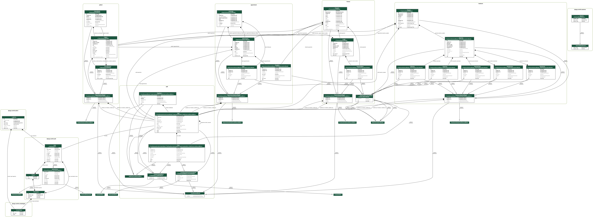

# Django Fun

## Business requirements

### Staff
- There are several roles
- Staff has Django User
- Staff has Role
- Staff has supervisor
- Supervisor has feedback for staff
- Staff has Schedule made up of timeslots

### Patients
- Patient have primary phone number
- patients have phone numbers
- phone number can have patients
- patients pay credit
- patient have many appointments
- staff have many appointments

### Appointments
- time slots are flexible
- appointment has a time slot
- appointment has a patient
- appointment has a staff
- appointment has a status
- appointment has several followups
- appointment has several appointment notes

### Finance
- payment modes
- payment is across appointment
- payment can have payment modes
- payment has a reference
- payment can be from patient credit
- staff has attached to time slot from x to y duration

### Treatment
- Difficulty
- Expertise
- Exercise Types
- Body Section is required for bucketing exercises based on different body parts
- Exercise has
    - Title
    - Exercise Type
    - Staff Expertise
    - Difficulty
    - multiple body sections
    - Information URL
    - Notes
- Exercise is from an exercise type
- An Exercise may impact multiple body parts
- Zero or more Equipment can be used in an exercise
- Regime is the recommended set/course of the Exercise attached to an appointment
- An Appointment can have one or more than exercises in it

## ERD

